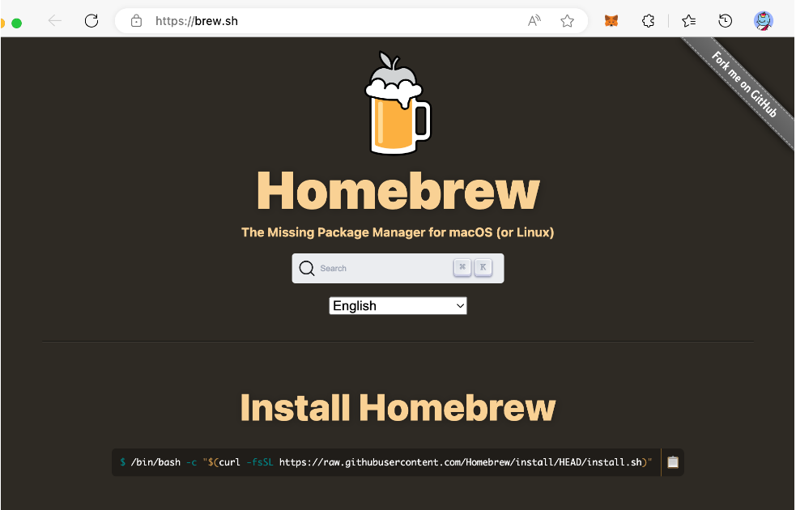

<div align="center">

  
  <h1>MindLake Tutorial: Configure Node</h1>
  
  <p>
    A step-by-step cookbook for Node Configuration !
  </p>
</div>

- [:star2: 0. Step by step tutorial](#star2-0-step-by-step-tutorial)
- [:star2: 1. Install Node Package Management Tools: Nvm](#star2-1-install-node-package-management-tools-nvm)
  - [:art: 1.1 For Mac OS](#art-11-for-mac-os)
    - [:dart: 1.1.2 Install Nvm with HomeBrew](#dart-112-install-nvm-with-homebrew)
      - [:gear: 1.1.2.1 Step1: Install HomeBrew (If you don't have Homebrew installed)](#gear-1121-step1-install-homebrew-if-you-dont-have-homebrew-installed)
      - [:gear: 1.1.2.2 Step2: Install Nvm](#gear-1122-step2-install-nvm)
      - [:gear: 1.1.2.3 Step3: Verify the Nvm Installation](#gear-1123-step3-verify-the-nvm-installation)
  - [:art: 1.2 For Windows](#art-12-for-windows)
    - [:dart: 1.2.1 Download Nvm](#dart-121-download-nvm)
    - [:dart: 1.2.2 Run exe installation file](#dart-122-run-exe-installation-file)
    - [:dart: 1.2.3 Validate nvm installation](#dart-123-validate-nvm-installation)
- [:star2: 2. Install Node](#star2-2-install-node)
  - [:art: 2.1 Install Node](#art-21-install-node)
  - [:art: 2.2 Select right Node 16 version if not correct](#art-22-select-right-node-16-version-if-not-correct)
  - [:art: 2.3 Validate if correct node version](#art-23-validate-if-correct-node-version)


## :star2: 0. Step by step tutorial
This is part of support chapter for MindLake step-by-step tutorial for [Typescript](README.md)

## :star2: 1. Install Node Package Management Tools: Nvm

### :art: 1.1 For Mac OS

#### :dart: 1.1.2 Install Nvm with HomeBrew
If you need to install Nvm from the command line on macOS, the Homebrew package manager is a reliable option. Follow the steps below to install Nvm via Homebrew:
##### :gear: 1.1.2.1 Step1: Install HomeBrew (If you don't have Homebrew installed)
1. Open a browser and go to https://brew.sh.



2. Under the "Install Homebrew" title, copy the command
```shell
/bin/bash -c "$(curl -fsSL https://raw.githubusercontent.com/Homebrew/install/HEAD/install.sh)"
```


3. Then open a terminal window, paste the copied command, and press the 'Enter' or 'Return' button.


4. Enter your macOS credentials if and when asked.
5. If prompted, install Apple's command line developer tools.

##### :gear: 1.1.2.2 Step2: Install Nvm
1. Enter the following command in terminal to upgrade Homebrew:
```shell
brew update && brew upgrade
```
2. Install `nvm` using this command:
```shell
brew install nvm
```
Next, create a directory for nvm at home.
```
mkdir ~/.nvm 
```
Now, configure the required environment variables. Edit the following configuration file in your home directory
```
vim ~/.bash_profile
```
and, add the below lines to `~/.bash_profile` ( or `~/.zshrc` for macOS Catalina or newer versions)
```
export NVM_DIR=~/.nvm
source $(brew --prefix nvm)/nvm.sh
```
Press `ESC` + `:wq` to save and close your file.

Next, load the variable to the current shell environment. From the next login, it will automatically loaded.
```
source ~/.bash_profile
```
That’s it. The nvm has been installed on your macOS system.

##### :gear: 1.1.2.3 Step3: Verify the Nvm Installation
Enter the following command in terminal:
```shell
nvm --version
```
An example of the output is:
```
1.1.7
```


### :art: 1.2 For Windows
Open Terminal on Windows:
1. press `WIN` + `R` key
2. type `CMD` in the prompt
3. press `ENTRY` key


#### :dart: 1.2.1 Download Nvm
1. Open a browser and go to [nvm downloads for Windows](https://github.com/coreybutler/nvm-windows/releases)
2. Download nvm-setup.exe


#### :dart: 1.2.2 Run exe installation file
Double Click nvm-setup.exe to run


#### :dart: 1.2.3 Validate nvm installation
  ```cmd
nvm version
```
An example of the output is:
```
1.1.7
```

## :star2: 2. Install Node
### :art: 2.1 Install Node
```
nvm install 16
```
An example of the output is:
```
Downloading node.js version 16.13.1 (64-bit)...
Complete
Creating D:\program\nvm\temp

Downloading npm version 8.1.2... Complete
Installing npm v8.1.2...

Installation complete. If you want to use this version, type

nvm use 16.13.1
```
### :art: 2.2 Select right Node 16 version if not correct
`Node16` is recommended. `Node18` still have issues and is not recommeded right now,
```cmd
nvm use 16
```
An example of the output is:
```
Now using node v16.13.1 (64-bit)
```

### :art: 2.3 Validate if correct node version
```cmd
node -v
```
An example of the output is:
```
v16.13.1
```
