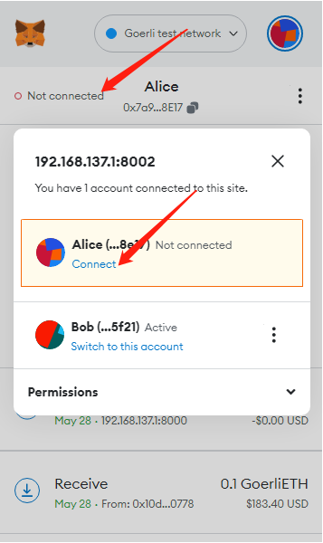
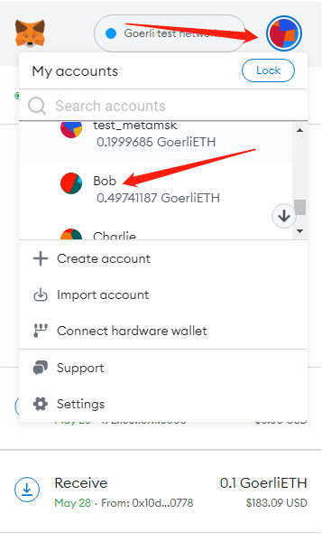
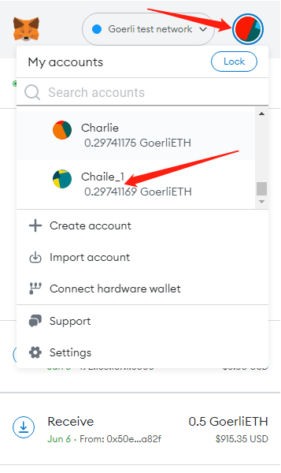

<div align="center">

  
  <h1>MindLake Tutorial: Typescript SDK</h1>
  
  <p>
    A step-by-step cookbook for beginner to access Mind Lake !
  </p>
</div>

<!-- toc generator: 1. install "markdown all in one" in vs code, 2. cmd: create table of contents -->
<!-- Table of Contents -->
## :notebook_with_decorative_cover: Table of Contents
- [:notebook\_with\_decorative\_cover: Table of Contents](#notebook_with_decorative_cover-table-of-contents)
- [:star2: 0. Other Programming Languages](#star2-0-other-programming-languages)
- [:star2: 1. Install Or Upgrade Node If Needed](#star2-1-install-or-upgrade-node-if-needed)
- [:star2: 2. Get Examples](#star2-2-get-examples)
- [:star2: 3. Prepare myconfig.ts](#star2-3-prepare-myconfigts)
- [:star2: 4. Execute the examples](#star2-4-execute-the-examples)
  - [:art: 4.1 QuickStart](#art-41-quickstart)
  - [:art: 4.2 Use Case 1: Single User with Structured Data](#art-42-use-case-1-single-user-with-structured-data)
  - [:art: 4.3 Use Case 2: Single User with Unstructured Data](#art-43-use-case-2-single-user-with-unstructured-data)
  - [:art: 4.4 Use Case 3: Multi Users with Permission Sharing](#art-44-use-case-3-multi-users-with-permission-sharing)


## :star2: 0. Other Programming Languages
- [Python](https://github.com/mind-network/mind-lake-sdk-python/)

## :star2: 1. Install Or Upgrade Node If Needed
- Click to view [step-by-step to configure Node](Configure_Node.md) if Node is not installed or upgraded

## :star2: 2. Get Examples
1. Enter the following command in the terminal window to fetch the example code from github:
```shell
git clone https://github.com/mind-network/mind-lake-sdk-typescript.git
```
2. Enter the path of example code:
```shell
cd mind-lake-sdk-typescript/examples
```
3. Install depedency
```cmd
npm install
```
4. Check mind-lake-sdk depedency 
```cmd
npm info mind-lake-sdk version
```
An example of the output is:
```cmd
1.0.2
```

## :star2: 3. Prepare myconfig.ts
1. `myconfig.ts` contains the settings of parameters used in examples and use cases, you can copy `myconfig_template.ts` to the name `myconfig.ts` and modify it as per your requirement.
2. `myconfig.ts` will need walletAddress and appKey.
  - 2.1. Click [:art: 4.1. Prepare Wallet](Configure_Wallet.md#art-41-prepare-wallet) if test wallets (by MetaMask) are not created.
  
  - 2.2 Click [:dart: 4.1.3 Register wallets if not in whitelist during testing period](Configure_Wallet.md#dart-413-register-wallets-if-not-in-whitelist-during-testing-period) if test wallets is not in whitelist during testing period.
  
  - 2.3 Click [:art: 4.2. Prepare appKey](Configure_Wallet.md#art-42-prepare-appkey) if `appKey` is not set.
  
3. If you want to run the examples of quickStart, Use Case 1 and Use Case 2, you only need to fill out `appKey`. 
4. If you want to run Use Case 3, you need to fill out the wallets info for all of `Alice`, `Bob` and `Charlie`.

```
export const appKey = "YOUR_APP_KEY";
export const nodeUrl = "https://sdk.mindnetwork.xyz"; // or change to other node url
export const aliceWalletAddress = "Alice_Wallet_Address";
export const bobWalletAddress = "Bob_Wallet_Address";
export const charlieWalletAddress = "Charlie_Wallet_Address";
```

## :star2: 4. Execute the examples
You can execute the following commands to run the quickstart and use cases.

```
cd examples
npm run start
```
An example of the output is:
```
  App running at:
  - Local:   http://localhost:8002 (copied to clipboard)
  - Network: http://192.168.137.1:8002
```
By default use 8000 as port number. But will auto increase port number if 8000 is used. You may see 8000 in your side. The example bellow 8002. Use the port number shown in your terminal.
Open a browser and visit `http://localhost:8002` 

### :art: 4.1 QuickStart

1. First, you should create a test wallet for test.
  
  

  

2. Click "Quick start with your MetaMask" and you will see the logs while login with your MetaMask wallet


### :art: 4.2 Use Case 1: Single User with Structured Data
1. Open a browser and visit `http://localhost:8002/use_case_1`
2. Click "Test case one with your MetaMask" and you will see the logs while executing Use Case 1.


### :art: 4.3 Use Case 2: Single User with Unstructured Data
1. Open a browser and visit `http://localhost:8002/use_case_2`
2. Click "Test case two with your MetaMask" and you will see the logs while executing Use Case 2


### :art: 4.4 Use Case 3: Multi Users with Permission Sharing
1. You will need 3 wallets for Use Case 3: Alice, Bob, Charlie
  We show how to create a wallet for Alice for testing purpose.

  

  

  Using the same way to create wallet for Bob and Charlie
  
  Copy Alice,Bob,Charlie' wallet address into myconfig.ts to update `aliceWalletAddress` `bobWalletAddress` `charlieWalletAddress`

  > **Note**
  > During testing period, please make you have all wallet address are registered in into whitelist: https://sites.google.com/mindnetwork.xyz/mindnetwork/alpha-test.
  > Be more specific, please ensure your Alice, Bob and Charlie are registered and approved. Otherwise, you may experience the error on sharing. 


2. Open a browser and visit `http://localhost:8002/use_case_3`


3. Switch to Alice's wallet and perform actions as Alice 

  

  

  Click "Insert Alice Data And Share To Charlie"
   
  
  
  Wait until "insert data done" appears which means data insertion is completely. 
   
4. Switch to BOb's wallet and performa actions as Bob

  

  

  Click "Insert Bob Data And Share To Charlie"  
  
  

  Wait until "insert data done" appears which means data insertion is completely. 
  
5. Switch to Charlie's wallet and performa actions as Charlie
  
  

  

  Click "Charlie Select Data And Decrypt Data"
  
  

6. Final output quick view

 

  
